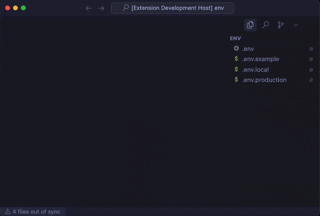

  

<h1 align="center">EnvSync-LE: Zero Hassle .env Sync</h1>

  <b>Effortlessly detect, compare, and synchronize .env files across your workspace.</b> 
  <i>Featuring visual diffs, automatic, manual, and template-based comparison modes.</i>
   
  <i>Designed for enterprise environments and large monorepos.</i>

  <!-- Marketplace -->
  
  <!-- Build -->
  
  <!-- License -->
  

---

  

 <a href="https://github.com/nolindnaidoo/envsync-le/blob/main/docs/SCREENSHOTS.md">Screenshot Guide</a>

## ✅ Why EnvSync‑LE

- **Simple sync detection**: Instantly see if your environment files are in sync.
- **One‑click details**: Click the status bar to open a comprehensive <a href="docs/SCREENSHOTS.md#sync-details-report">visual diff report</a> showing which files are out of sync and which keys are missing.
- **Clear signals**: Status bar indicators for in-sync, missing/extra keys, and parse errors.
- **Flexible modes**: Auto scan, manual selection, or compare all files to a template.
- **Noise control**: Ignore comments, toggle case sensitivity, and debounce checks.
- **Granular scope**: Include/exclude file patterns and temporarily ignore specific files.

## 🚀 Quick Start

1. Install from the VS Code Marketplace.
2. Open a workspace containing one or more `.env*` files.
3. Watch the status bar for sync status, or run commands:
   - Compare Selected .env Files
   - Set/Clear Template
   - Ignore/Stop Ignoring/Clear All Ignored
   - Open DotSync‑LE Settings

## 🔁 Comparison Modes

- **Auto**: Discover and compare all `.env*` files automatically.
- **Manual**: You pick which files to compare.
- **Template**: Treat one file as the source of truth and compare others to it.

## 📣 Status Bar & Notifications

- In‑sync: Green check with tooltip summary.
- Out‑of‑sync: Warning with number of affected files; click to open a detailed sync report.
- Parse errors: Error state with guidance to fix.
- Notification levels: `all`, `important`, or `silent`.

## 🧾 Sync Details Report

- Open via status bar click or the command: `DotSync‑LE: Show Sync Details`.
- Summarizes checked files, overall status, and issues.
- Lists missing keys per file and the reference file used for comparison.
- Includes parse/read errors, when present.

## 🧭 Commands

- `EnvSync‑LE: Show Sync Details` (`envsync-le.showIssues`)
- `EnvSync‑LE: Open Settings` (`envsync-le.openSettings`)
- `EnvSync‑LE: Compare Selected .env Files` (`envsync-le.compareSelected`)
- `EnvSync‑LE: Set Template File` (`envsync-le.setTemplate`)
- `EnvSync‑LE: Clear Template File` (`envsync-le.clearTemplate`)
- `EnvSync‑LE: Ignore File` (`envsync-le.ignoreFile`)
- `EnvSync‑LE: Stop Ignoring File` (`envsync-le.stopIgnoring`)
- `EnvSync‑LE: Clear All Ignored Files` (`envsync-le.clearAllIgnored`)

## ⚙️ Configuration

- `envsync-le.enabled` – Enable or disable the extension
- `envsync-le.watchPatterns` – Glob patterns for files to watch (default: `**/.env*`)
- `envsync-le.excludePatterns` – Globs to exclude from watching
- `envsync-le.notificationLevel` – `all` | `important` | `silent`
- `envsync-le.statusBar.enabled` – Toggle status bar indicator
- `envsync-le.debounceMs` – Debounce time (ms) before checking sync
- `envsync-le.ignoreComments` – Ignore `#` commented lines when parsing
- `envsync-le.caseSensitive` – Case‑sensitive key comparison
- `envsync-le.comparisonMode` – `auto` | `manual` | `template`
- `envsync-le.compareOnlyFiles` – Explicit files list for manual mode
- `envsync-le.templateFile` – Template path for template mode
- `envsync-le.temporaryIgnore` – Files temporarily excluded from checks

## 🧩 Compatibility

- Works in standard workspaces.
- Limited support in virtual/untrusted workspaces (no file watching in some cases).

## 🔒 Privacy & Telemetry

- Runs locally; no data is sent off your machine.
- Optional local‑only logs can be enabled with `envsync-le.telemetryEnabled`.

## 📊 Test Coverage

- Tests powered by Vitest with V8 coverage.
- Runs quickly and locally: `npm run test` or `npm run test:coverage`.
- Coverage reports output to `coverage/` (HTML summary at `coverage/index.html`).
- Core logic is designed for unit testing; additional suites will expand over time.

## 🤝 Contributing

We welcome all contributions! Whether it's code, ideas, or feedback

- [Issues](https://github.com/nolindnaidoo/envsync-le/issues) • [Pull Requests](https://github.com/nolindnaidoo/envsync-le/pulls) • [Releases](https://github.com/nolindnaidoo/envsync-le/releases)
- [Screenshots](https://github.com/nolindnaidoo/envsync-le/blob/main/docs/SCREENSHOTS.md)
---

Copyright © 2025
<a href="https://github.com/nolindnaidoo">@nolindnaidoo</a>. All rights reserved.
